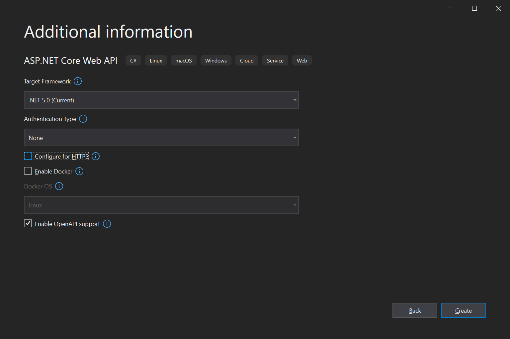
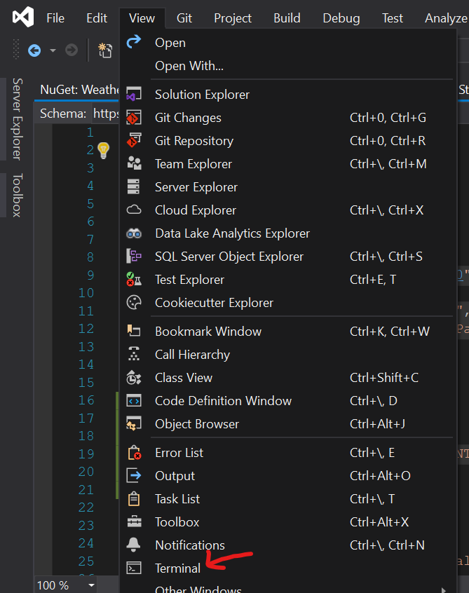

# Getting to know Steeltoe - Actuators

## Prerequisities

* .NET 5 SDK
* Visual Studio
* Java 11  (if launching dependencies directly as jar). Download binaries from https://github.com/Tanzu-Solutions-Engineering/spring-cloud-binaries/releases/tag/2.5.3

## Goal

Understand how Steeltoe is distributed (Nuget) and how one adds components into an existing application. After completing this tutorial we'll be able to have basic observability setup that allows us to monitor application health and access internal telemetry. 

## Expected Results

Begin building an API that will be enhanced with more components in the next exercise(s).

## Get Started

Let's start by creating a brand new .NET Core webapi project.

Select "Create a new project". (If Visual Studio is already open, choose `File > New > Project`.)

Choose "ASP.NET Core Web API" from the default templates.


The default project name WeatherService will be used throughout


Choose .NET 5.0 as the target framework and turn off HTTPS support to make things simple for this tutorial.


After project opens, switch default launch profile to use Kestrel instead of IIS. You can do this by clicking the arrow next to play button and select WeatherService.


---

## Add Project Dependencies

Once the project is created and opened in your IDE, the first action is to bring in the Steeltoe packages to the app. 

** We will be using PowerShell to speed up adding necessary NuGet dependencies to speed things up and avoid any mistakes. Same steps can be accomplished via Visual Studio IDE Nuget integration**

Open Visual Studio Terminal window by going to `View ->  Terminal`



# 

```powershell
dotnet add WeatherService\WeatherService.csproj package Steeltoe.Bootstrap.Autoconfig
dotnet add WeatherService\WeatherService.csproj package Steeltoe.Management.Endpointcore
dotnet add WeatherService\WeatherService.csproj package Steeltoe.Extensions.Logging.DynamicLogger
dotnet add WeatherService\WeatherService.csproj package Steeltoe.Extensions.Configuration.SpringBootCore
```

---

## Implement Steeltoe packages

Steeltoe features are broken up into packages, giving you the option to only bring in and extend the dependencies needed. As we implement each package within the application we'll discuss why these packages were chosen. While each package can be configured explicitly by following standard .NET pattern (via extension methods on HostBuilder in `Program.cs`,  and setup calls in Startup.cs), we'll be relying on Steeltoe autoconfiguration which automatically configures itself just based on the presence of the necessary nuget packages. This facility is provided by `Steeltoe.Bootstrap.Autoconfig`.

First enable autoconfig by editing `Program.cs` and modify as following:

```csharp
using Steeltoe.Bootstrap.Autoconfig;
...
public static IHostBuilder CreateHostBuilder(string[] args) =>
    Host.CreateDefaultBuilder(args)
        .ConfigureWebHostDefaults(webBuilder =>
        {
            webBuilder.UseStartup<Startup>();
        })
    .AddSteeltoe();
```

This will activate the other two packages we imported. Steeltoe.Management.Endpointcore instruments our application with management endpoints which expose telemetry about internal state of our app. By default these are available on `/actuator` endpoint, and expose the following:

- The health actuator will add a new endpoint at `/actuator/health`. Internally this function uses .NET's IHealthContributor to "decide" if everything is reporting good health and responds with HTTP 200 status. Also within the response body there is a json formatted message to accommodate a deeper check that specific platforms like Cloud Foundry and Kubernetes do.
- The info actuator adds a new endpoint at `/actuator/info`. This function gathers all kinds of information like versioning information, select package information, and DLL info. Everything is formatted as json and included in the response.

The Steeltoe.Extensions.Logging.DynamicLogger builds on Console logger, but allows log levels to be changed at runtime via actuators. We'll see how this works later.

Steeltoe.Extensions.Configuration.SpringBootCore package will allow us to publish the actuator telemetry into a centralized dashboard.

The above actuators are enabled by default as they don't carry sensitive information and are generally safe to expose publicly. However, Steeltoe has many other powerful actuators that expose detailed internal telemetry of the app and runtime environment. Let's turn those on by adding the following to appsettings.json:

 ```csharp
 {
   ...
   "Management": {
     "Endpoints": {
       "Actuator": {
         "Exposure": {
           "Include": [ "*" ]
         }
       }
     }
   }
 }
 
 ```

Normally when you do this you also want to enable an authorization policy to restrict access to these endpoints to only authorized users based on security scheme of your app. While this is beyond the scope of this tutorial, you can explore  how to do this in [this Steeltoe sample](https://github.com/SteeltoeOSS/Samples/tree/main/Management/src/SpringBootAdmin).

## Setup logging sample

In order to demonstrate logging, lets add a log statement to our controller. Edit `Controllers\WeatherForecastController.cs` add add the following log statement to our Get method

```csharp
...
public IEnumerable<WeatherForecast> Get()
{
  _logger.LogDebug("Weather is good");
  ...
```


## Connect app to Spring Boot Admin

Spring Boot Admin project is a Web UI application that you can run as either a docker container or a simple java app. When configured in your application, it will register itself on startup with Spring Boot Admin which in turn will start monitoring the app's actuator endpoints to gather and expose telemetry via an administrative management portal. 

Launch Spring Boot Admin by running 

````
c:\workshop\services\_run-spring-boot.bat
````

Modify your app to register with Spring Boot Admin. Edit `Startup.cs` as following:

```csharp
using Steeltoe.Management.Endpoint.SpringBootAdminClient;
...
public void Configure(IApplicationBuilder app, IWebHostEnvironment env)
{
    app.RegisterWithSpringBootAdmin(Configuration);
		...
```

Lets also give our app a name and point it to the Spring Boot Admin endpoint. Edit `appsettings.json`

```json
{  
  "Spring": {
    "Application": {
      "Name": "WeatherService"
    },
    "Boot": {
      "Admin": {
        "Client": {
          "Url": "http://localhost:8080",
          "Metadata": {
            "user.name": "actuatorUser",
            "user.password": "actuatorPassword"
          }
        }
      }
    }
  }
  ...
}
```

>  Note that we've configured metadata to supply name and password that Spring Boot Admin can use to authenticate with our endpoints. This will be sent during the initial registration. Since we didn't setup actuator security, this configuration doesn't affect anything at this stage.

## Run the application

With everything configured, lets see it all come together in action. 

Run the application.

## Discovering the actuators

Access `/actuator` endpoint and browse the different actuator endpoints to observe wealth of published information, including `/actuator/info`, `/actuator/health` and `/actuator/env`.

```json
{
    "self": {
        "href": "http://localhost:5000/actuator",
        "templated": false
    },
    "threaddump": {
        "href": "http://localhost:5000/actuator/threaddump",
        "templated": false
    },
    "heapdump": {
        "href": "http://localhost:5000/actuator/heapdump",
        "templated": false
    },
    "dbmigrations": {
        "href": "http://localhost:5000/actuator/dbmigrations",
        "templated": false
    },
    "env": {
        "href": "http://localhost:5000/actuator/env",
        "templated": false
    },
    "info": {
        "href": "http://localhost:5000/actuator/info",
        "templated": false
    },
    "health": {
        "href": "http://localhost:5000/actuator/health",
        "templated": false
    },
    "loggers": {
        "href": "http://localhost:5000/actuator/loggers",
        "templated": false
    },
    "httptrace": {
        "href": "http://localhost:5000/actuator/httptrace",
        "templated": false
    },
    "mappings": {
        "href": "http://localhost:5000/actuator/mappings",
        "templated": false
    },
    "metrics": {
        "href": "http://localhost:5000/actuator/metrics",
        "templated": false
    },
    "prometheus": {
        "href": "http://localhost:5000/actuator/prometheus",
        "templated": false
    },
    "refresh": {
        "href": "http://localhost:5000/actuator/refresh",
        "templated": false
    }
}
```

Access `http://localhost:8080/` and notice that the app has registered itself with Spring Boot Admin


Click on the app to go to details (don't click on the URL itself as that points to app's URL, but the area around it).


Explore different telemetry published from the app. 

## Changing log levels at runtime

Try accessing `/WeatherForecast`. Now check the application console. 

Notice that even though we get the response, the log statement we added isn't printed to console. The reason is that default logging level is set to `Information` or higher, whereas we're logging at `Debug` level. 

From Spring Boot Admin, go to Loggers, find `WeatherService` logger, and set it's value to Debug. 


Now try accessing `/WeatherForecast` again. Notice that now we are outputting our logs.


Ability to change logs dynamically is very powerful for the purposes of diagnosing production issues when we want to temporarily increase logging level to gather extra insight on how the app is executing without restarting the app. The log level can be turned back down after gathering the necessary information.