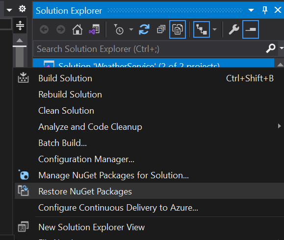
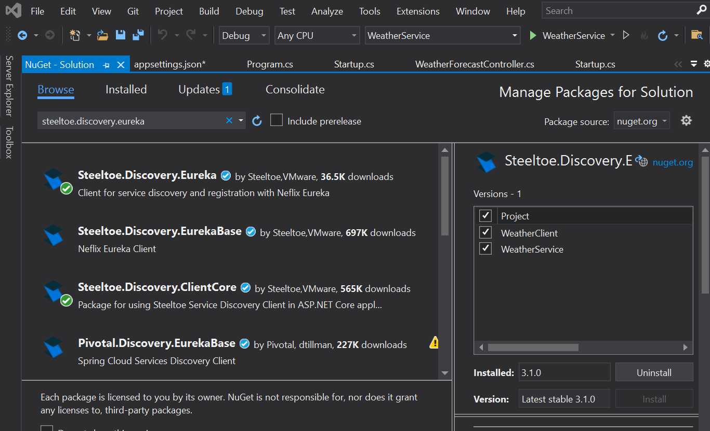
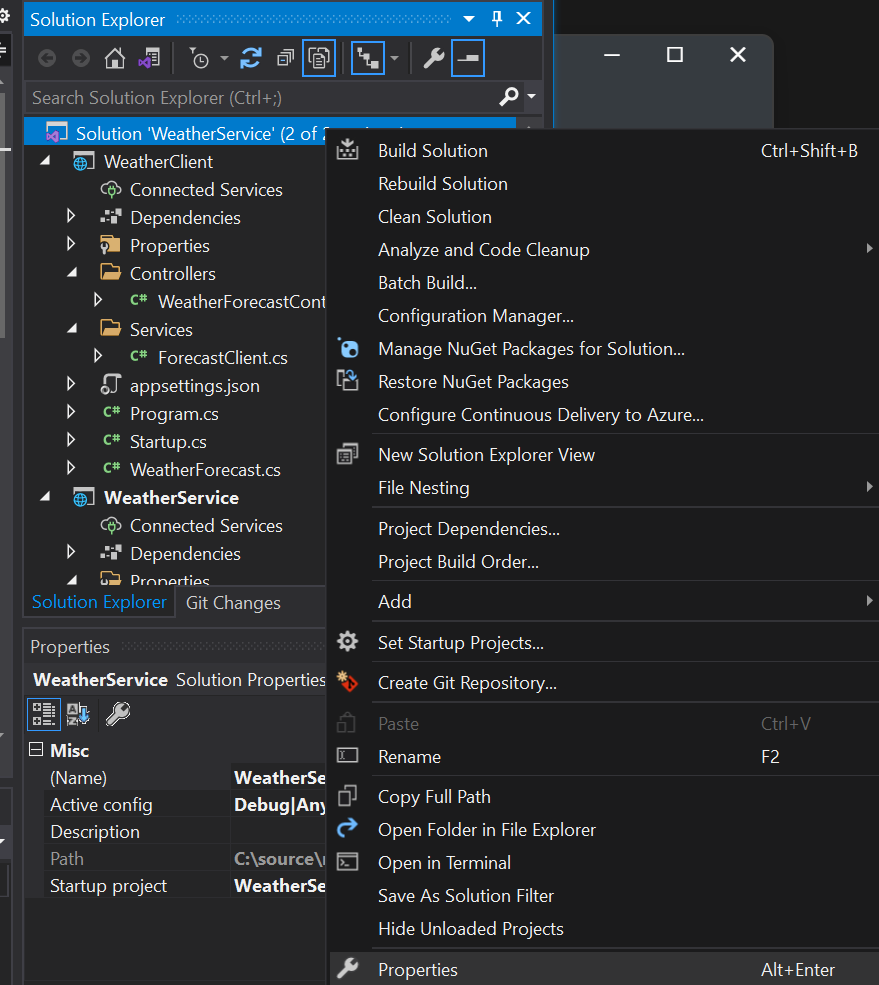
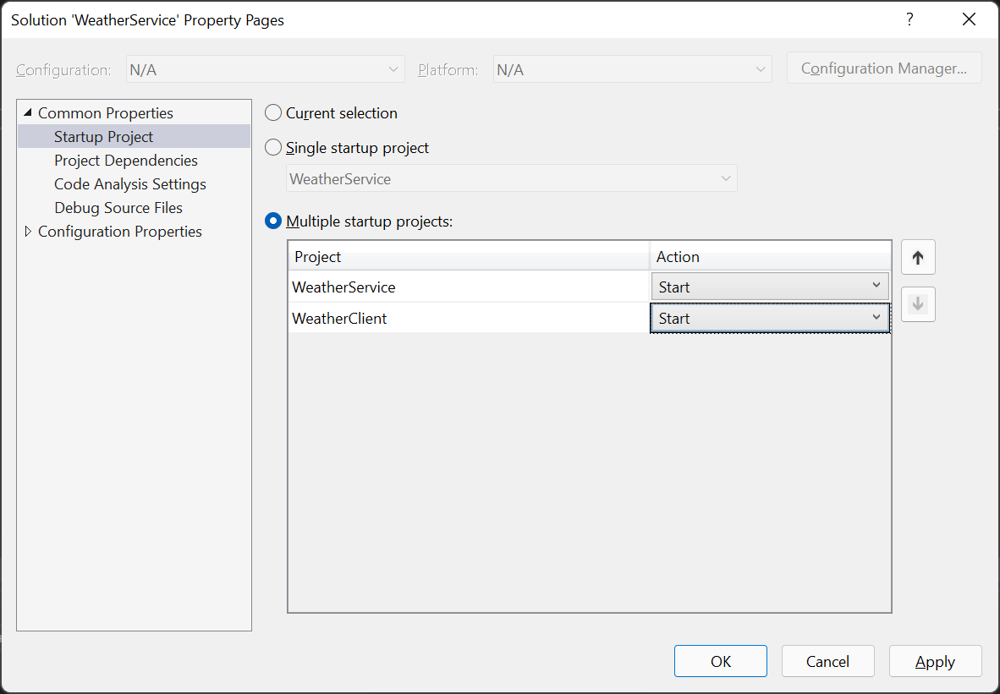
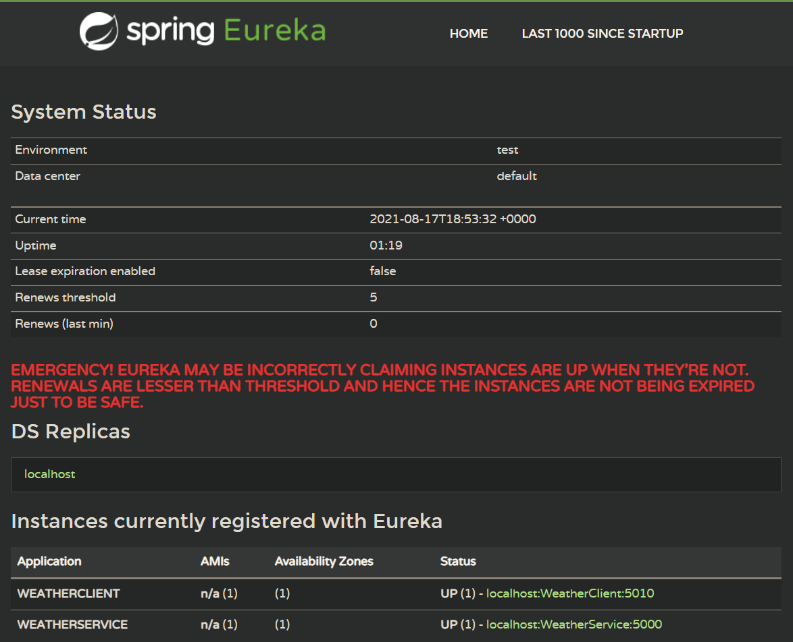
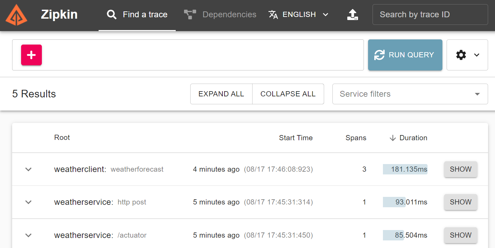
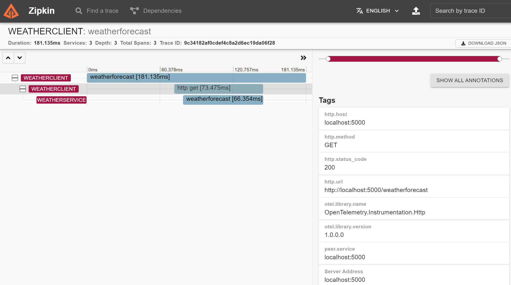

# Getting to know Steeltoe - Service Discovery

## Goal

Create a client application that talks to our backend API, connect both using service discovery, and setup distributed tracing.

## Expected Results

A client application talks to backend service by referencing it by common name instead of URL

## Get Started

Start by adding a new project to our existing solution. In order to automate the process and skip some boilerplate instructions, lets do this from command line. Open command line to directory with our solution file, and run the following commands:

 ```powershell
 dotnet new webapi -n WeatherClient --no-https
 dotnet sln add .\WeatherClient\WeatherClient.csproj
 dotnet add WeatherClient\WeatherClient.csproj package Steeltoe.Bootstrap.Autoconfig 
 dotnet add WeatherClient\WeatherClient.csproj package Steeltoe.Management.Endpointcore
 dotnet add WeatherClient\WeatherClient.csproj package Steeltoe.Extensions.Logging.DynamicLogger
 dotnet add WeatherClient\WeatherClient.csproj package Steeltoe.Extensions.Configuration.SpringBootCore
 ```

In WeatherClient project, edit Program.cs as following:

```csharp
using Steeltoe.Bootstrap.Autoconfig;
...
public static IHostBuilder CreateHostBuilder(string[] args) =>
    Host.CreateDefaultBuilder(args)
        .ConfigureWebHostDefaults(webBuilder =>
        {
            webBuilder.UseStartup<Startup>();
        })
    .AddSteeltoe();
```

Edit Startup.cs as following:

```csharp
using Steeltoe.Management.Endpoint.SpringBootAdminClient;
...
public void Configure(IApplicationBuilder app, IWebHostEnvironment env)
{
    app.RegisterWithSpringBootAdmin(Configuration);
		...
```

Replace appsettings.json in WeatherClient with following:

```json
{
  "Spring": {
    "Application": {
      "Name": "WeatherClient"
    },
    "Boot": {
      "Admin": {
        "Client": {
          "Url": "http://localhost:8080",
          "Metadata": {
            "user.name": "actuatorUser",
            "user.password": "actuatorPassword"
          }
        }
      }
    }
  },
  "Logging": {
    "LogLevel": {
      "Default": "Information",
      "Microsoft": "Warning",
      "Microsoft.Hosting.Lifetime": "Information"
    }
  },
  "AllowedHosts": "*",
  "Management": {
    "Endpoints": {
      "Actuator": {
        "Exposure": {
          "Include": [ "*" ]
        }
      }
    }
  }
}
```

Lets also make it run on a different port then our backend. Edit `Properties\launchSettings.json` and **REPLACE** it as following. This will remove the default IIS launch profile which we don't need.

```json
{
  "$schema": "http://json.schemastore.org/launchsettings.json",
  "profiles": {
    "WeatherClient": {
      "commandName": "Project",
      "dotnetRunMessages": "true",
      "launchBrowser": true,
      "launchUrl": "swagger",
      "applicationUrl": "http://localhost:5010",
      "environmentVariables": {
        "ASPNETCORE_ENVIRONMENT": "Development"
      }
    }
  }
}
```


## Add service discovery and tracing

At this point both projects are configured to register with Spring Boot Admin and instrumented with actuators. Now lets add service discovery. When configured, both apps will publish their URLs and well known names into a central registry. Any other app connected to same registry can look up a URL for a given service by name. This lets you avoid the hassle of changing URLs in config across environments. The central registry is provided by Eureka service implemented as part of Spring Cloud umbrella project. 

We're also going to add distributed tracing and export the results to Zipkin to allow calls to be traced across both services.

Add the following dependencies to both projects:

```
Steeltoe.Discovery.ClientCore
Steeltoe.Discovery.Eureka
System.Net.Http.Json
Steeltoe.Management.TracingCore
OpenTelemetry.Exporter.Zipkin
```

# [Visual Studio](#tab/visual-studio)

Right click on solution in Solution Explorer, and click Manage Nuget Packages in Solution



On the Browse tab, Search for the packages specified, and put checkboxes on each project, then click Install.

 

# [.NET CLI](#tab/dotnet-cli)

From solution folder

```powershell
dotnet add WeatherClient\WeatherClient.csproj package Steeltoe.Discovery.ClientCore
dotnet add WeatherClient\WeatherClient.csproj package Steeltoe.Discovery.Eureka
dotnet add WeatherClient\WeatherClient.csproj package System.Net.Http.Json
dotnet add WeatherClient\WeatherClient.csproj package OpenTelemetry.Exporter.Zipkin
dotnet add WeatherClient\WeatherClient.csproj package Steeltoe.Management.TracingCore
dotnet add WeatherService\WeatherService.csproj package Steeltoe.Discovery.ClientCore
dotnet add WeatherService\WeatherService.csproj package Steeltoe.Discovery.Eureka
dotnet add WeatherService\WeatherService.csproj package System.Net.Http.Json
dotnet add WeatherService\WeatherService.csproj package OpenTelemetry.Exporter.Zipkin
dotnet add WeatherService\WeatherService.csproj package Steeltoe.Management.TracingCore
```

---

## Modify client to talk to our service

First lets create a typed client (aka a facade) to talk to our backend service. In WeatherClient project, add new class under `Services\ForecastClient.cs`, and make it look as following:

```csharp
using Microsoft.Extensions.Logging;
using System;
using System.Collections.Generic;
using System.Linq;
using System.Net.Http;
using System.Net.Http.Json;
using System.Threading.Tasks;

namespace WeatherClient.Services
{
    public class ForecastClient
    {
        private HttpClient _httpClient;
        private ILogger _logger;
        public ForecastClient(HttpClient httpClient, ILogger<ForecastClient> logger)
        {
            _httpClient = httpClient;
            _logger = logger;
        }

        public async Task<IEnumerable<WeatherForecast>> GetForecast()
        {
            var result = await _httpClient.GetFromJsonAsync<List<WeatherForecast>>("/weatherforecast");
            _logger.LogInformation($"Received {result.Count} forecasts");
            return result;
        }
    }
}

```

Notice that we're only using a relative URL in HttpClient. This is because the client is pre-configured for a specific endpoint base URL, which is tied to service discovery mechanism. Lets do that now. 

Edit `Startup.cs` in WeatherClient project and modify as following:

```csharp
using Steeltoe.Common.Http.Discovery;
using WeatherClient.Services;
...
  public void ConfigureServices(IServiceCollection services)
{
  services.AddHttpClient("WeatherClient", c =>
                         {
                           c.BaseAddress = new Uri("http://WeatherService/");
                         })
    .AddServiceDiscovery()
    .AddTypedClient<ForecastClient>();
  ...
```

 

This configures ForecastClient for dependency injection, and the injected instance of HttpClient will already be configured with base URL resolved by a well known service name of `WeatherService`. All that's left now is to use it in our controller. Modify `Controllers\WeatherForecastController.cs` to get forecasts through our ForecastClient:

```csharp
using WeatherClient.Services;
...
[HttpGet]
public async Task<IEnumerable<WeatherForecast>> Get([FromServices]ForecastClient client)
{
  return await client.GetForecast();
}
```

Finally, set the eureka URL by editing appsettings.json in **both** WeatherService and WeatherClient and adding the following. The url defaults to the one below so this step can be skipped in local environments.

```json
  "Eureka": {
    "Client": {
      "ServiceUrl": "http://localhost:8761/eureka/"
    }
  }
```

 

## Run Eureka discovery service and Zipkin

Lets launch our eureka registry and zipkin before starting the app

# [Java Jar](#tab/java-jar)

From terminal set to folder where you downloaded JAR, invoke 

```powershell
java -jar eureka-2.5.4.jar
java -jar zipkin-server-2.23.2-exec.jar
```

# [.NET CLI](#tab/docker)

```powershell
docker run -it --rm -p:8080:8080 steeltoeoss/eureka
docker run -it --rm -p 9411:9411 openzipkin/zipkin
```

---

## Start projects

Lets start both projects and see it all in action

# [Visual Studio](#tab/visual-studio)

Right click on the solution in Solution explorer, and click Properties



Under Startup Project, switch to Multiple startup projects, and set Action of each project to Start



# [.NET CLI](#tab/dotnet-cli)

Open two command prompts and run the following in each project folder

```powershell
WeatherService > dotnet run
```


```
WeatherClient> dotnet run
```


---

Confirm that both apps registered with Eureka by browsing to http://localhost:8761/



Access WeatherClient to make it fetch reports from WeatherService: http://localhost:5010/WeatherForecast

```
info: System.Net.Http.HttpClient.WeatherClient.LogicalHandler[100]
       [WeatherClient,9c34182af0cdef4c8a2d6ec19da06f28,aabf1786817ef54a,true] Start processing HTTP request GET http://weatherservice/weatherforecast
info: System.Net.Http.HttpClient.WeatherClient.ClientHandler[100]
       [WeatherClient,9c34182af0cdef4c8a2d6ec19da06f28,aabf1786817ef54a,true] Sending HTTP request GET http://localhost:5000/weatherforecast
info: System.Net.Http.HttpClient.WeatherClient.ClientHandler[101]
       [WeatherClient,9c34182af0cdef4c8a2d6ec19da06f28,aabf1786817ef54a,true] Received HTTP response headers after 81.0985ms - 200
info: System.Net.Http.HttpClient.WeatherClient.LogicalHandler[101]
       [WeatherClient,9c34182af0cdef4c8a2d6ec19da06f28,aabf1786817ef54a,true] End processing HTTP request after 97.977ms - 200
info: WeatherClient.Services.ForecastClient[0]
       [WeatherClient,9c34182af0cdef4c8a2d6ec19da06f28,aabf1786817ef54a,true] Received 5 forecasts
```

Notice how the URL was automatically resolved to correct URL for WeatherService even though we never had to specify it anywhere in the client. Also note that each log entry is stamped with zipkin trace information. This allows correlation of logs across services when this is exported to a logging solution that supports Zipkin. 

## View distributed trace

Access Zipkin at http://localhost:9411/. You should see some requests already have been captured. 



Click on the one that has multiple spans

Observe how we can view the request spanning multiple services as a single logical request stack. Information associated with each child call can be looked at individually.



