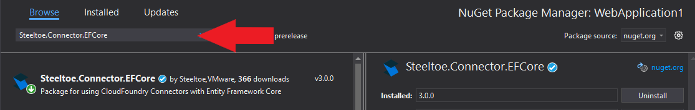
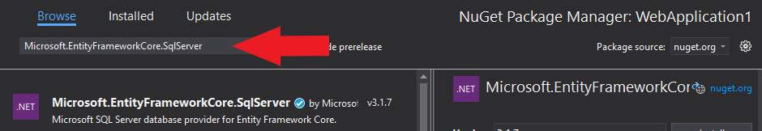
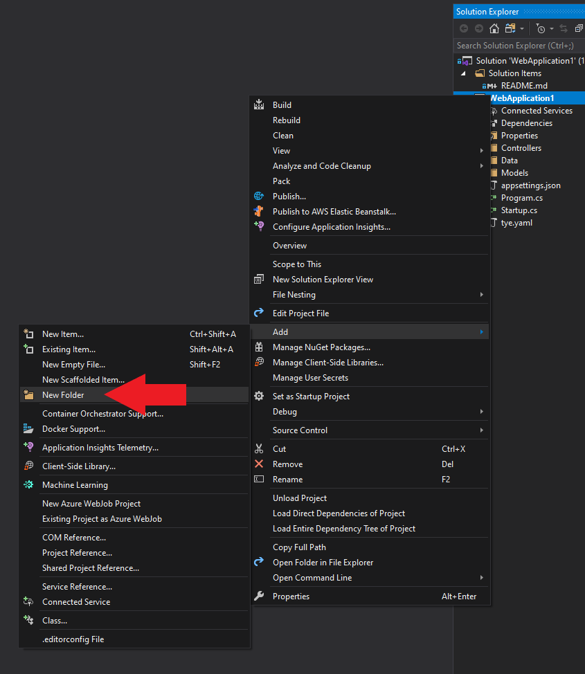
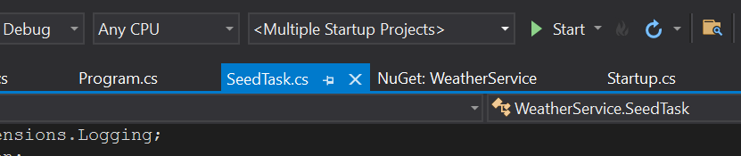

# Adding a cloud connector with SQL

## Goal

Connect the backend to the database with Steeltoe Connectors and see how connection management is done. Connectors have the benefit of automatically configuring your service connections based on the environment your app is running in, rather then you having to manage it manually through configuration. This concept is already available on cloud platforms such as as Cloud Foundry and soon will be available in Kubernetes. 

## Expected Results

App initializes the database and serves weather forecasts from the database

> [!NOTE]
> For this exercise an MS SQL database have already been initialized. The settings have been preloaded below.

## Get Started

We're going to add a database connection and context using entity framework to the previously created application.

# [Visual Studio](#tab/visual-studio)

Right click on the project name in the solution explorer and choose "Manage NuGet packages...". In the package manger window choose "Browse", then search for `Steeltoe.Connector.EFCore`, and install.


Then search for the `Microsoft.EntityFrameworkCore.SqlServer` package and install.


# [.NET CLI](#tab/dotnet-cli)

```powershell
dotnet add WeatherService\WeatherService.csproj package Steeltoe.Connector.EFCore
dotnet add WeatherService\WeatherService.csproj package Microsoft.EntityFrameworkCore.SqlServer
dotnet add WeatherService\WeatherService.csproj package Steeltoe.Management.TaskCore
```

---

## Add database context and model

Now create a new folder in the project named 'Models'.

# [Visual Studio](#tab/visual-studio)

Right click on the WeatherService project name in the solution explorer and choose "Add" > "New Folder" and name it `Models`.



# [.NET CLI](#tab/dotnet-cli)

```powershell
mkdir "Models"
cd "Models"
```

---

Within that folder create a new class named 'WeatherContext.cs'. This class will serve as our context for interacting with the database.

Open the newly created class file in your IDE and make it look like the following

```csharp
using Microsoft.EntityFrameworkCore;

namespace WeatherService.Models
{
    public class WeatherContext : DbContext
    {
        public WeatherContext() : base() { }
        public WeatherContext(DbContextOptions<WeatherContext> options) : base(options)
        {
        }

        public DbSet<WeatherForecast> WeatherForecasts { get; set; }
    }
}

```

We also need a key for our WeatherForecast object. Modify WeatherForecast.cs and add the following property

```csharp
public class WeatherForecast
{
	public Guid Id { get; set; }
  ...
```

## Implement the database context and ensure its creation

Now that we have created the 'WeatherContext' we need to add it to the services container.

> [NOTE!]
> If prompted, there is not need to add any other packages like a SqlClient. The Steeltoe package takes care of everything.

Open "Startup.cs" in your IDE and add the using statement

```csharp
using Steeltoe.Connector.SqlServer.EFCore;
```

Then append the 'add db' statement to the 'ConfigureServices' method and save the changes

```csharp
public void ConfigureServices(IServiceCollection services) 
{
  services.AddDbContext<Models.WeatherContext>(options => options.UseSqlServer(Configuration));

  //...
}
```

## Modify controller to read from database

Edit WeatherForecastController.cs and modify as following

```csharp
using Microsoft.AspNetCore.Mvc;
using Microsoft.EntityFrameworkCore;
using Microsoft.Extensions.Logging;
using System;
using System.Collections.Generic;
using System.Linq;

using System.Threading.Tasks;
using WeatherService.Models;

namespace WeatherService.Controllers
{
    [ApiController]
    [Route("[controller]")]
    public class WeatherForecastController : ControllerBase
    {
        
        private readonly ILogger<WeatherForecastController> _logger;
        private readonly WeatherContext _dbcontext;

        public WeatherForecastController(ILogger<WeatherForecastController> logger, WeatherContext dbcontext)
        {
            _logger = logger;
            _dbcontext = dbcontext;
        }

        [HttpGet]
        public async Task<IEnumerable<WeatherForecast>> Get()
        {
            _logger.LogDebug("Weather is good");
            return await _dbcontext.WeatherForecasts.ToListAsync();
        }
    }
}

```


## Update appsettings.json with database connection

Add the below json to 'appsettings.json', just after the 'management' section. This will give Steeltoe connection information for the database instance as well as name the new database.

```json
"SqlServer": {
  "Credentials": {
    "ConnectionString": "Server=(localdb)\\mssqllocaldb;database=WeatherForecast;Trusted_Connection=True;"
  }
}
```

If you have SQL Express installed, it is running locally and the above connection string would work out of the box. You can also lauch SQL Server as a docker image as following:

```
docker run -e "ACCEPT_EULA=Y" -e "SA_PASSWORD=IheartSteeltoe1" -p 1433:1433 -d mcr.microsoft.com/mssql/server:2019-latest
```

For docker based setup, set the connection string to

````
Server=localhost;Database=WeatherForecast;User Id=sa;Password=IheartSteeltoe1;
````


## Managing database creation with Tasks

Because we are going to be interacting with a brand new database instance we'll need to make sure the database has been initialized before the application can fully start up. Often times this is done on application startup. While this approach works OK for some projects, it can often cause problems when databases become large. The startup may make application unusable until database initialization / migration is complete. Some cloud systems will also terminate applications that fail to startup in reasonable time, preventing database initialization from ever completing.

Steeltoe provides a way of bundling invokable "tasks" with your application and invoking them independently. Lets create a database seed task now.

Create a class called "SeedTask" at the root of your project and make it look like the following:

```csharp
using Microsoft.Extensions.Logging;
using Steeltoe.Common;
using System;
using System.Linq;
using WeatherService.Models;

namespace WeatherService
{
    public class SeedTask : IApplicationTask
    {
        private readonly WeatherContext _context;
        private readonly ILogger<SeedTask> _logger;

        public string Name => "seed";
        public SeedTask(WeatherContext context, ILogger<SeedTask> logger)
        {
            _context = context;
            _logger = logger;
        }

        public void Run()
        {
            
            if(_context.Database.EnsureCreated())
            {
                _logger.LogInformation("Database created");
                string[] Summaries = new[] { "Freezing", "Bracing", "Chilly", "Cool", "Mild", "Warm", "Balmy", "Hot", "Sweltering", "Scorching" };
                var rng = new Random();
                var forecasts = Enumerable.Range(1, 5)
                    .Select(index => new WeatherForecast
                    {
                        Date = DateTime.Now.AddDays(index),
                        TemperatureC = rng.Next(-20, 55),
                        Summary = Summaries[rng.Next(Summaries.Length)]
                    })
                    .ToArray();
                _context.WeatherForecasts.AddRange(forecasts);
                _context.SaveChanges();
                _logger.LogInformation($"Database seeded with {forecasts.Length} records");
            }
            else
            {
                _logger.LogInformation("Database already exists");
            }
        }
    }
}


```

The above sets up a task called "seed". If the database doesn't exist, it will create it and run seed logic to insert some random forecasts in it. Now we need to register our task. Modify startup.cs like this

```csharp
using Steeltoe.Management.TaskCore;
...
public void ConfigureServices(IServiceCollection services)
{
  services.AddTask<SeedTask>();
  ...
```

Now lets give us ability to invoke tasks as an alternative mode for running the app. Modify Program.cs as following:

```csharp
using Steeltoe.Management.TaskCore;
...
public static void Main(string[] args)
{
  CreateHostBuilder(args).Build().RunWithTasks();
}
```


## Seed the database

Invoke the seed command by launching the app with "runtask seed" argument. Open terminal, switch to WeatherService project folder (where WeatherService.csproj file is), and invoke the following command:

```powershell
dotnet run -p WeatherService\WeatherService.csproj runtask=seed
```

If you did everything correctly you should see

```
Building...
info: WeatherService.SeedTask[0]
      Database created
info: WeatherService.SeedTask[0]
      Database seeded with 5 records
```

## Start the app

Start the solution as before 

# [Visual Studio](#tab/visual-studio)

Click the Play button on your toolbar



# [.NET CLI](#tab/dotnet-cli)

Run weather service 

```
dotnet run -p WeatherService\WeatherService.csproj
```

------

Try accessing WeatherService url at `http://localhost:5000/weatherforecast`. Notice how the id column is now being displayed as well, confirming that the records are coming from our database.
