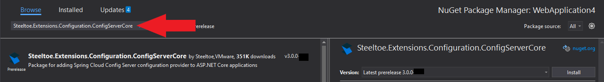


# Using an external configuration provider

## Goal

Setup an external git repo holding configuration values and using Spring Config to retrieve the values, in a .NET Core application.

## Expected Results

With a running instance of Spring Config server, navigate to an endpoint in a .NET Core application and see the values output.

> [!NOTE]
> For this exercise a Spring Config server have already been initialized. The settings have been preloaded below.

## Get Started

To communicate with an external config server we're going to need to add a client to the previously created application. We're also going to add placeholder provider that allows us to define config values by referencing OTHER config sections as variables, reducing duplication.  

# [Visual Studio](#tab/visual-studio)

Right click on the project name in the solution explorer and choose "Manage NuGet packages...". In the package manger window choose "Browse", then search for `Steeltoe.Extensions.Configuration.ConfigServerCore`, and install.



also add this package

```
Steeltoe.Extensions.Configuration.PlaceholderCore
```


# [.NET CLI](#tab/dotnet-cli)

```powershell
dotnet add package Steeltoe.Extensions.Configuration.ConfigServerCore
dotnet add package Steeltoe.Extensions.Configuration.PlaceholderCore
```

---

## Implement Spring Config client

Open "Program.cs" and implement a Spring Config client in the host builder.

```csharp
using Steeltoe.Extensions.Configuration.ConfigServer;
```

```csharp
public static IHostBuilder CreateHostBuilder(string[] args) =>
            Host.CreateDefaultBuilder(args)
                .AddConfigServer()
                .ConfigureWebHostDefaults(webBuilder =>
                {
                    webBuilder.UseStartup<Startup>();
                })
                .AddSteeltoe();
```

## Modify controller to read config

Lets add a method to our controller that reads and displays a config value. Add the following method to `WeatherService` class:

```csharp
using Microsoft.Extensions.Configuration;
...
  
[HttpGet("location")]
public string GetLocation([FromServices] IConfiguration config) => config.GetValue<string>("location");
```

 

In 'appsettings.json' **add** the following json just below to the `Spring` section. Config server reads which environment it should config for by reading `Spring:Cloud:Config:Env` configuration key. We're going to map its value with Steeltoe placeholder provider to `ASPNETCORE_ENVIRONMENT`, which is the default way for configuring environments in ASP.NET Core.

```json
"Spring": {
  "Application": {
      "Name": "WeatherService"
    },
  "Cloud": {
    "Config": {
      "Env": "${ASPNETCORE_ENVIRONMENT}",
    }
  }
}
```

> [!NOTE]
> Notice the value of `spring:application:name` in the json. This value of "WeatherService" will be used to connect the correct values in the Spring Config server, as the config server can be servicing multiple apps.

## Run Config Server

Application configuration has been externalized into a Git repo, and the actual values are served by Spring Config Server. We can launch Spring Config Server and point it to our config git repo from which it will serve values. Lets do that now

# [Java app](#tab:java)

First lets set environmental variables for location of our config repo


```powershell
PS> $env:SPRING_CLOUD_CONFIG_SERVER_GIT_URI="https://github.com/macsux/workshop-config-repo.git"
PS> java -jar config-server-2.5.3.jar 
```


## [Docker](#tab:docker)

Run the following command

```
docker run -e SPRING_CLOUD_CONFIG_SERVER_GIT_URI=https://github.com/macsux/workshop-config-repo.git -p:8888:8888 --rm -it steeltoeoss/config-server
```

------


## Run the application

Lets launch WeatherService 

# [Visual Studio](#tab/visual-studio)

Clicking the `Debug > Start Debugging` top menu item. You may be prompted to "trust the IIS Express SSL certificate" and install the certificate. It's safe, trust us. Once started your default browser should open and automatically load the weather forecast endpoint.


# [.NET CLI](#tab/dotnet-cli)

Executing the below command will start the application. 

```powershell
dotnet run
```

---

With the application running, access `http://localhost:5000/weatherforecast/location`.

You should see the value of `Toronto` displayed. Now examine the config repo we used for config server: https://github.com/macsux/workshop-config-repo, specifically `WeatherService.yml` and `WeatherService-Development.yml`. By default, when launching locally, the app starts in "Development" environment. Now lets change it to run under production environment.

Edit `Properties\launchSettings.json` and change value for `ASPNETCORE_ENVIRONMENT` to `Production` under `WeatherService` profile.

Relaunch the app and check `http://localhost:5000/weatherforecast/location` again. You should see `New York`. 


---

## Summary

With an existing Spring Config server running that was configured to retrieve values from a yaml file, we added a Spring Config client to our application and output the retrieved vale. With this architecture in place you can now do things like updating the yaml file and visit the `/actuator/refresh` management endpoint in the application. This will automatically refresh values within the application without and down time (or restart). You could store a server's connection name in the yaml and have the application retrieve the value. As the application moves through different environments (dev, test, staging, prod) the connection value can change, but the original tested application stays unchanged.

We've just begun to scratch the surface of what Spring Config can really do and all it's many features. Learn more about config in the [Steeltoe docs](https://steeltoe.io/api/v3/configuration/config-server-provider.html).
